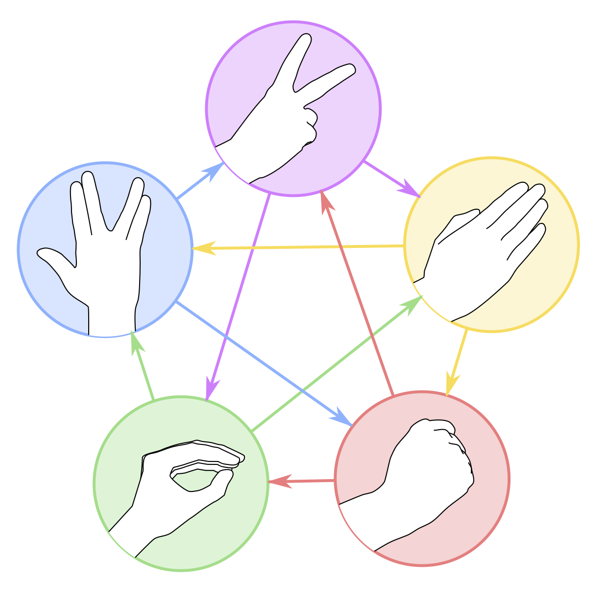

# throwdown
rock paper scissors lizard spock for Erlang

## Build

This application was written and tested on OTP 20. It uses maps which were
introduced in OTP 17, so it ought to work in any OTP release that supports
maps.

It has no dependencies. 

Use rebar3 to compile the code:

    $ rebar3 compile

## Run

You can start the application by using rebar3:

    $ rebar3 shell --apps throwdown

Once you're at the Erlang shell prompt, you can start a new game session like this:

    1> throwdown:start_game([<<"player1">>, <<"player2">>, ..., <<"playerN">>]).

Once you get above four or five players, usually games end in every player losing.

